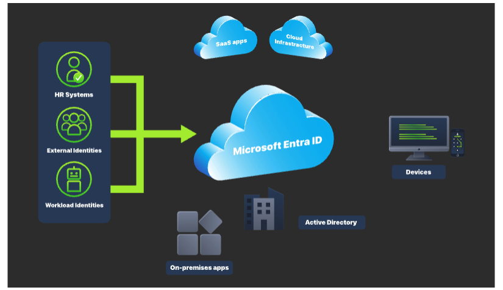

# Why Companies Moved Identities to the Cloud?
    Before cloud identity providers, organizations like FineGalo managed identity separately for each platform. Security controls were tied to individual systems, meaning protections like MFA, strong password policies, and access restrictions were available only if the platform supported them, for example:

        Internal Email Server
            Does not support MFA
        HR System
            Does not provide authentication logs
        Project Management Tool
            Does not enforce password policies
        File Sharing Service
            Does not support access controls

    As companies moved to SaaS platforms and remote work, this fragmented model became hard to manage and even harder to secure. Platforms like Microsoft Entra ID solve this by centralizing authentication (who the user is) and authorization (what the user is allowed to do) into a single control plane.

    This leads to the classic question: "Identities are only user (person) access credentials?"

# What is an Identity?
    A digital identity is a set of attributes that uniquely represent an entity within a computer system. That entity can be a person, a device, or a software component. Identities are sued to authenticate entities, authorize their access to resources, enable communication, and support actions such as accessing services or performing transactions.

    At a high level, identities can be grouped into three categories:

        Human identities
            Represent people, such as employees, contractors, partners, customers, vendors, or consultants.

        Machine identities
            Workload identities
                Represents software components, including applications, services, scripts, or containers, that need to authenticate to other systems.
            Device identities
                Represent physical devices like desktops, laptops, mobile phones, and IoT devices. These identities are separate from the humans who use them.

    An Identity Provider (IdP) is the system responsible for creating and managing these identities. It handles authentication (verifying identity), authorization (controlling access), and auditing by recording identity-related activity across connected services.

        

    Microsoft Entra ID is an example of a cloud-based identity provider. Other examples including Twitter, Google, Amazon, LinkedIn, and Apple.

    Benefits of an IdP
        Centralized authentication and management
            All user sign-ins are handled in a single location, making it easier to manage access and investigate suspicious activity.
        Single Sign-On (SSO)
            One successful authentication grants access to multiple cloud services, improving usability while reducing password sprawl.
        Stronger authentication
            Features such as MFA and Conditional Access can be enforced uniformly across users and applications, rather than configured per system.
        Better visibility and logging
            Every authentication attempt generates rich identity logs, giving analysts the context needed to detect and investigate threats.
