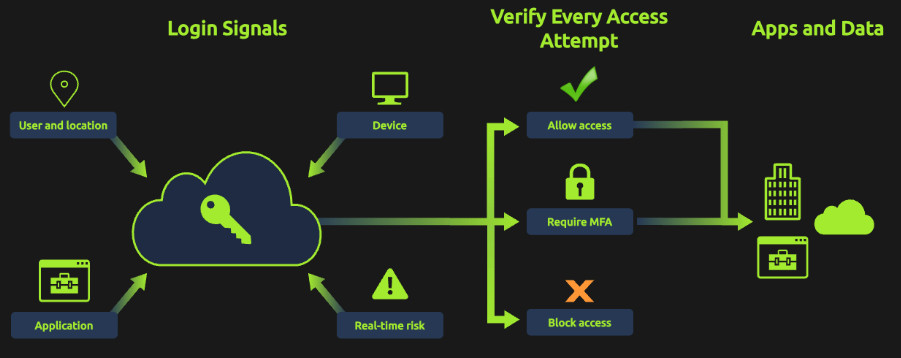

## Identity as the Target
    In a cloud-first organization like FineGalo, Entra ID is the gateway to everything. It authenticates users and authorizes access to services like Outlook, Teams, SharePoint, and internal applications. That means a single compromised account, especially a privileged one, can give an attacker legitimate access without needing malware, local system access, or foothold inside the network.

# Why attackers are targeting cloud credentials
    Attackers target cloud-based identity providers because they provide:
        Remote access from anywhere:
            Authentication occurs over the internet, so attackers don't need access to the internal network.

        Legitimate access to multiple services via SSO:
            One successful sign-in can unlock emails, files, chat, and connected apps for a user.

        Out of the radar of traditional tools:
            Firewalls and endpoint tools may see nothing suspicous because the attacker is using valid credentials or the authentication is occuring outside of their visibility.

        Direct access to high-value resources:
            Email and collaboration platforms contain sensitive data, internal communication, and often allow resetting account credentials and other authentication factors.

# Cloud Identity provides security gaps
    Cloud identity providers usually offer strong security controls, but those controls only work when they're properly configured and consistently enforced. In many incidents, attackers don't rely on advanced exploits; they simply exploit the lack of these security configurations.

    Using Entra ID as an example, the diagram below ilustrates how the platform evaluates authentication signals to decide whether to allow, block, or request MFA validation before a user can access the organization's apps and data.

        

    Common misconfigurations (or lack of configuration) that increase the risk of compromise:
        Lack of multi-factor authentication (MFA) enforcement
            Attackers can gain access with simple stolen credentials, bypassing MFA entirely.
        Overly permissive access policies
            Broad policies or group exclusions create gaps, allowing sign-ins from any location or exempting admin accounts from security requirements.
        Excessive admistrative privileges
            Too many admin accounts or standing privileges increase the attack surface and, if compromised, provide full tenant control.
        Weak password policies
            Default settings may allow easily guessable passwords without protection against know breaches or common password lists.
        Disabled authentication risk policies
            Risky authentication attempts from suspicious IPs or locations may permitted if security policies aren't enabled.
        Insufficient logging and monitoring
            Without active monitoring of sign-in and audit logs, suspicious activity can persist undetected for extended periods.

    Importance of Identity Logs
        The logs can reveal:
            Successful and failed logins
            Reasons for failed logins (e.g., bad password)
            Account lockouts
            MFA prompts and results
            Source IP address and users' geographic location
            Device and browser information
            Client/app used to authenticate (browser.mobile app, etc)
            Conditional Access outcomes (allowed, blocked, MFA required, etc)

        These identity data can also be used to correlate with service logs, such as M365, to analyze what the user did after successfully accessing an account (mailboxes access/managementm file downloads, chat activity, etc).

        NOTE: It's important to mention that these logs can be tricky because they're very rich, capturing every step of every interaction in Entra ID or M365 environments. When analyzing them, use a timeline approach to understand what's happening from a user or application perspective.
