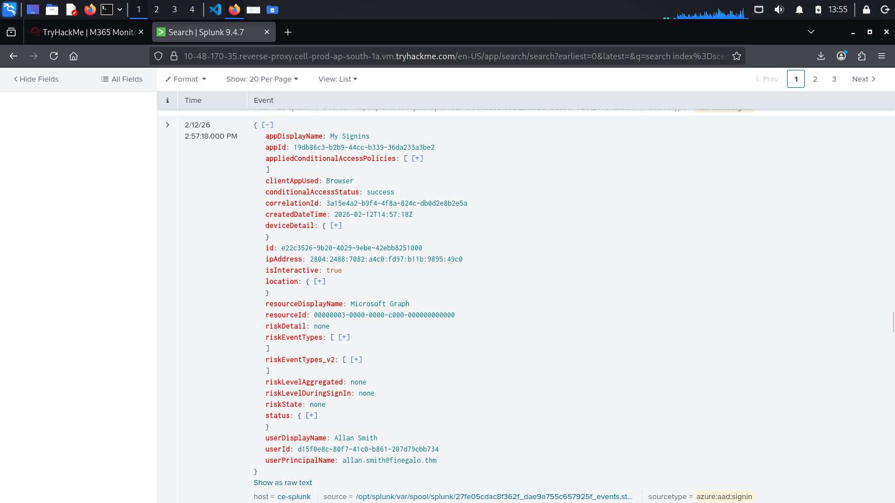
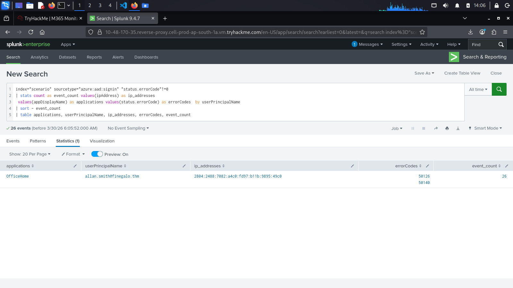
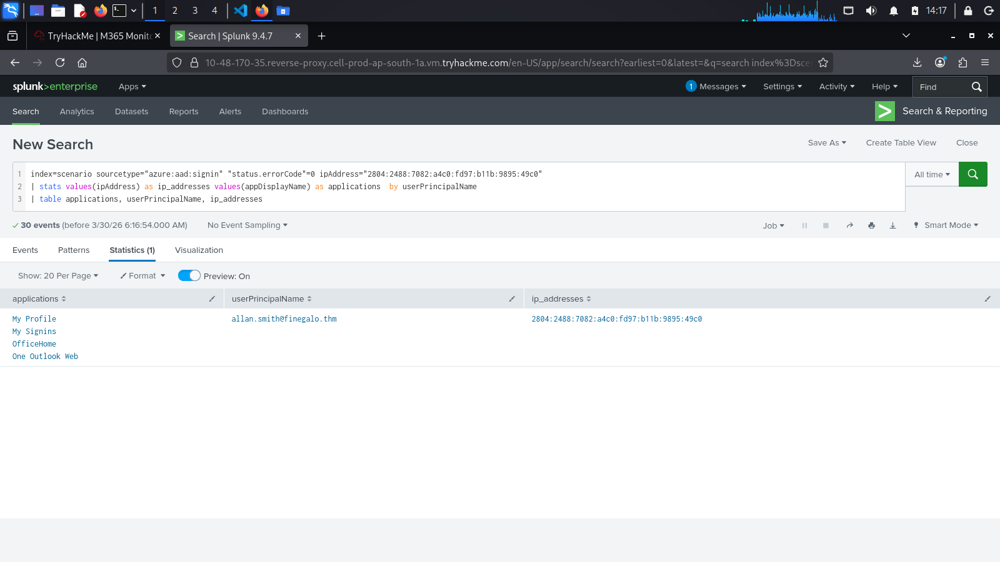

## Entra ID Sign-Ins Logs
    Microsoft Entra ID generates detailed logs for every authentication attempt, configuration change, and administrative action within a tenant. These logs don't just tell what happened, they tell who did it, when, where from, and often why it succeeded or failed.

# Entra ID Core Components
    Users and Sign-ins (Authentication)
        Every time a user attempts to authenticate to any service protected by Entra ID, a record is created. This includes successful logins, failed attempts, MFA challenges, and the context around each event (IP address, location, device, application, and others).

    Roles and Access Decisions (Authorization)
        After authentication, Entra ID determines what the user is allowed to do based on their assigned roles and permissions. Changes to these roles, group memberships, or permissions are all logged in audit events.

    Security Features
        Entra ID includes built-in security capabilities that generate their own logs:

            Multi-factor authentication (MFA):
                Logs show whether MFA was required, prompted, satisfied, or bypassed.
            Conditional Access policies:
                These policies enforce rules like "require MFA from untrusted locations." Logs show which policies were applied and their outcomes (allowed, blocked, MFA required).
            Identity Protection
                Entra ID's native threat detection flags risky sign-ins (impossible travel, anonymous IP, password spray) and risky users.

# Exploring Entra ID logs

    NOTE: The images below are the result from the prompt in Splunk search query in the  TryHackMe lab.

        In the Splunk instance, start hunting by filtering all the Sign-in (authentication) logs:

            List all Sign-in events

                "index=scenario sourcetype="azure:aad:signin"

                

                Note: Entra ID was previously named Azure Active Directory (Azure AD). If there is "Azure Active Directory" or "Azure AD" in the logs or elsewhere, it is the same as Entra ID.

        With this context, can use the "errorCode" to find failure attempts and other relevant data:

            List all failed Sign-ins

                "index="scenario" sourcetype="azure:aad:signin" "status.errorCode"!=0
                | stats count as event_count values(ipAddress) as ip_addresses
                values(appDisplayName) as applications values(status.errorCode) as errorCodes  by userPrincipalName
                | sort - event_count
                | table applications, userPrincipalName, ip_addresses, errorCodes, event_count"

                

        Error codes are a big ally when analyzing suspicious authentication alerts. They can help you to understand the stage of a credential attack the attacker is in. Below are common error codes:

            50126
                Invalid username or password
            50053
                Account locked due to too many failed attempts
            50074
                MFA required but not provided
            50055
                Password expired

        In the same query results, all failed attempts are from the same source IP in the ipAddress field. This is relevant information for further investigations into what this IP address has done in the tenant.

        Now, we can filter the successful logins from this source and validate which account was compromised and the applications the attacker accessed by changing the <ADD-IPHERE> placeholder to the IP address we want to investigate in the following query:

            List all successful Sign-ins from an IP address

                "index=scenario sourcetype="azure:aad:signin" "status.errorCode"=0 ipAddress="<ADD-IP-HERE>"
                | stats values(ipAddress) as ip_addresses values(appDisplayName) as applications  by userPrincipalName
                | table applications, userPrincipalName, ip_addresses"

                

