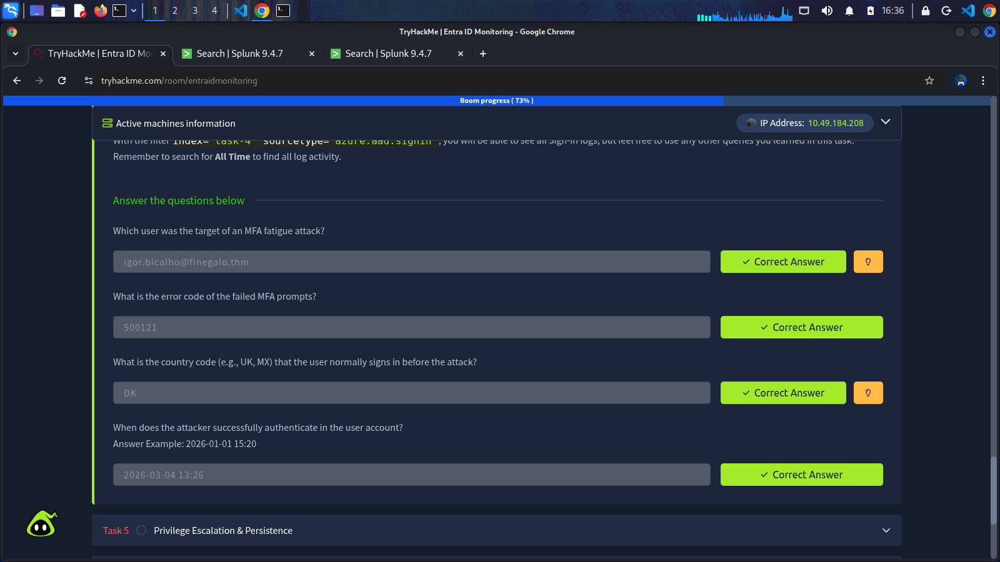

MFA (Multi-Factor Authentication) is the single most impactful control against password-based attacks. Once an attacker has valid credentials, MFA is the wall between them and a full account takeover. Based on a Microsoft reports, MFA blocks over 99% of automated credential-based attacks.

## How MFA Works in Entra ID
When a user signs in, Entra ID breaks authenticaiton into two sequential challenges:

- **Something you know**: the user enters their username and password. Entra ID validates these credentials against the directory.
- **Something you have**: if the password is correct (and a Conditional Access policy that enforces MFA is active), Entra ID sends a second challenge to a pre-registered method.

Only after both factors are satisfied does Entra ID generate a session token and grant access to the requested resource. Unfortunately, MFA is not a silver bullt. Attackers have developed techniques to bypass it without ever breaking the cryptography.

## MFA Fatigue (Prompt Bombing)
The attacker already has valid credentials. They initiate repeated authentication attempts in rapid succession, each one generating an Authenticator push notification on the victim's phone. The goal is to overwhelm the user until they approve one, out of frustration, confusion or mistaken belief that it's a legitimate prompt.

This is a social engineering attack, not a technical one. It works because push notifications give the user a single button to approve without any additional context about where the sign-in is coming from.

How it looks in logs:
- A high volume of MFA prompts against a single account in a short window.
- MFA-related error codes, such as **50074**, **50076**, **500121**, repeated.
- If the user approves, followed eventually by error code **0**.

Microsoft has partially mitigated this with number matching (the user must enter a number shown on the login scren into their Authenticator app) and additional context (the app shows location and app name). These controls make fatigue attacks significantly harder.

### List MFA failures by user
    index="task-4" sourcetype="azure:aad:signin" (status.errorCode=50074 OR status.errorCode=50076 OR status.errorCode=500121)
    | stats count as mfa_failures values(status.errorCode) as errorCodes values(status.failureReason) as failureReasons by userPrincipalName, ipAddress
    | sort - mfa_failures

## SIM swapping
When SMS is used as the MFA method, an attacker can convince a mobile carrier to port the victim's phone number to a SIM they control, allowing them to receive all SMS codes. This primarily poses a threat to consumer accounts and organizations that still rely on SMS-based MFA. The mitigation is straightforward, move away from SMS as a factor.

In logs, this technique is characterized by:
- A successful logon using an unusual device or browser for a user.
- A successful logon from an unusual location for a user.

## Adversary-in-the-Middle (AiTM) Phishing
Aitm is a more sophisticated technique. The attacker sets up a reverse proxy between the victim and the legitimate Microsoft login page. The victim authenticates normally, including completing MFA, but the proxy captures the session token issued after authentication. The attacker then replays that token on their own machine, bypassing MFA entirely because authentication has already occured.

From the token's perspective, the session is legitimate. The attack doesn't break MFA; it steals the MFA result. The pattern can be described as:
- The sign-in succeeds without a new MFA prompt because the token already carries proof that MFA was completed during the original (victim's) authentication.
- The source IP and location differ from those where MFA was originally completed.
- Conditional Access shows the session as compliant. The policy was satisfied, just not by the person who's now using the token.

This is why token theft is so dangerous: from Entra ID's perspective, everything looks fine. The only anomalies are geography and IP, which requre an analyst to connect the dots between two separate sign-in events.

## Impossible Travel
An attacker that has bypassed authentication, whether through SIM Swapping or by stealing a session token (AiTM), often ends up authenticating from a location that makes no physical sense relative to the user's last known sign-in location. This is the basis for one of the most reliable detection signals in Entra ID: **Impossible travel**.

We can hunt for the pattern proactively, directly in Sign-in logs, by using Splunk query below and trying to spot logins from different countries in a timestamp that is physically impossible.

### List successful sign-in activity for a user

    index="task-4" sourcetype="azure:aad:signin" status.errorCode=0
    | table _time, userPrincipalName, ipAddress, location.countryOrRegion, conditionalAccessStatus
    | sort - _time

### List "ImpossibleTravel" alerts in Identity Protection logs

    index="task-4" sourcetype="azure:aad:identity_protection:riskdetection"
    | where riskEventType="impossibleTravel"
    | table _time, userPrincipalName, activity, ipAddress, location.countryOrRegion, riskLevel, riskEventType
    | sort - _time

### Legitimate False Positives
Not every impossible travel event is malicious. Before confirming an incident, do consider:
- **Corporate VPNs** - A user connecting through a VPN exit node in another country will appear to sign in from that country, even while sitting in their office.
- **Split tunnelling** - Some traffic goes through the VPN, some doesn't, producing sign-ins from multiple apparent locations simultaneously.
- **Cloud service IPs** - Automated sign-ins from Microsoft services or third-party integrations can produce location anomalies.

## Tasks Completed

