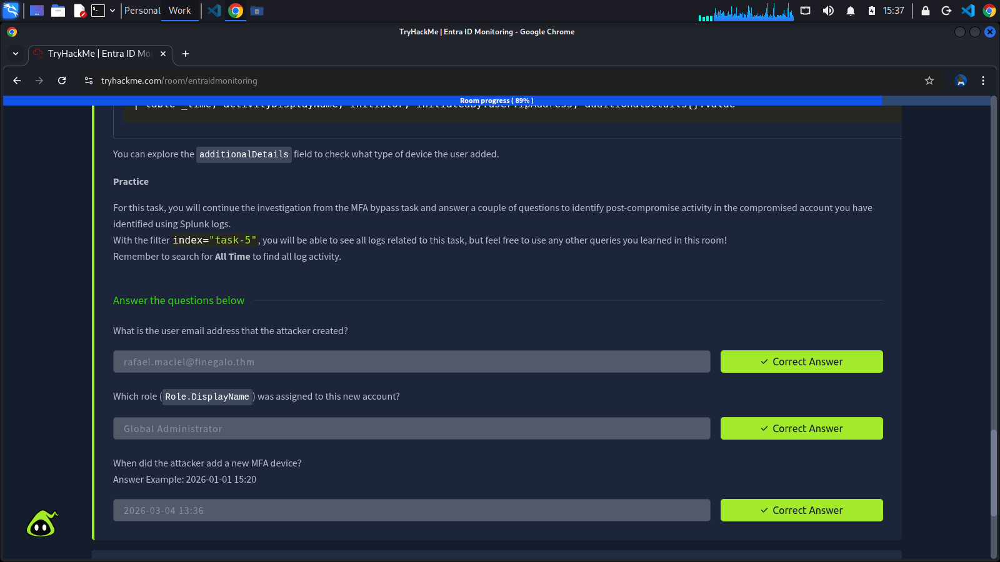

Once an attacker has a foothold, their next priority is two things: expand their access and make sure they can keep it even if the compromised account is locked out or its password is reset.

    This task introduces the most common post-compromise actions that an attacker takes in Entra ID. The focus here is on recognition, knowing what to look for in Audit logs.

## Common Post-Compromise Techniques
When the attacker is authenticated and begins taking action within the tenant, the relevant evidence is moved to **Audit Logs**.

Audit logs capture administrative actions and any changes to the tenant's state. Role assignments, user creation, policy modifications. All changes land there. Once a user is suspected to be compromised, the key filtering is **activiyDisplayName**, which indicates the action the user performed,

To filter all audit logs performed in a tenant, we can use the following Splunk query:

### List all audit logs

    index="task-5" sourcetype="azure:aad:audit"

The main fields we should pay attention to in an investigation of post-compromise activity are:
- **activityDisplayName**: The detailed activity or action that was performed by a user or app.
- **intiatedBy**: The account or app that performed the action.
- **targetResources**: The account or objects that have been changed or affected by an action.

These field answer the most important question for analyzing post-compromise: what was changed (**activityDisplayName**), who made that change (**initiatedBy**), and the details of the changes (**targetResources**).

## Role Assignment
This is the most direct path to elevated access: assign a privileged Entra ID role to the compromised account (or to a new account the attacker creates). Below are common target roles:
- **Global Administrator**: Full control over the tenant.
- **Exchange Administator**: Access to all mailboxes.
- **User Administrator**: Can reset passwords and modify accounts.
- **Application Administrator**: Can manage app registrations and consent grants.

A legitimate role assignment isn't inherently suspicious. What's suspicious is a role assignment that happens outside normal provisioning workflows. For example, at an unusual time, initiated by an account that doesn't normally perform these actions, targeting an account that was recently involved in suspicious sign-in activity.

Use the query below to list all assigned role activities in a tenant. Remember to explore the **targetResources** field to see what role was added to a user:

### List all assigned role activities

    index="task-5" sourcetype="azure:aad:audit" activityDisplayName="Add member to role"
    | table _time, activityDisplayName, initiatedBy.user.userPrincipalName, targetResources{}.userPrincipalName, targetResources{}.modifiedProperties{}.newValue | sort - _time

## Creating Backdoor Accounts
A new admin account created outside normal HR/IT provisioning flows is a classic example of a persistence mechanism. The attacker creates it, assigns it a privileged role, and uses it as a fallback if the original compromised account is remediated.

Use the Splunk query below to list all accounts created within a tenant:

### List all user creation activities

    index="task-5" sourcetype="azure:aad:audit" activityDisplayName="Add user"
    | eval initiator=coalesce('initiatedBy.user.userPrincipalName','initiatedBy.app.displayName')
    | eval userCreated='targetResources{}.userPrincipalName'
    | table _time, activityDisplayName,initiator, userCreated

## Adding Alternate MFA Methods
If an attacker registers their own authenticator app or phone number on the compromised account, they maintain access even after the victim changes their password, since they control the MFA factor. This shows up in Audit logs as a MFA registration event on a user object, initiated by the user themselves.

When onboarding a MFA device, it can generate multiple types of logs for each step. To validate if a user attempted to add a MFA device to their account, we can use the Splunk query below:

    index="task-5" sourcetype="azure:aad:audit" activityDisplayName="User started security info registration" loggedByService="Authentication Methods"  operationType="Add"
    | eval initiator=coalesce('initiatedBy.user.userPrincipalName','initiatedBy.app.displayName')
    | table _time, activityDisplayName, initiator, initiatedBy.user.ipAddress, additionalDetails{}.value

## Completed Tasks

