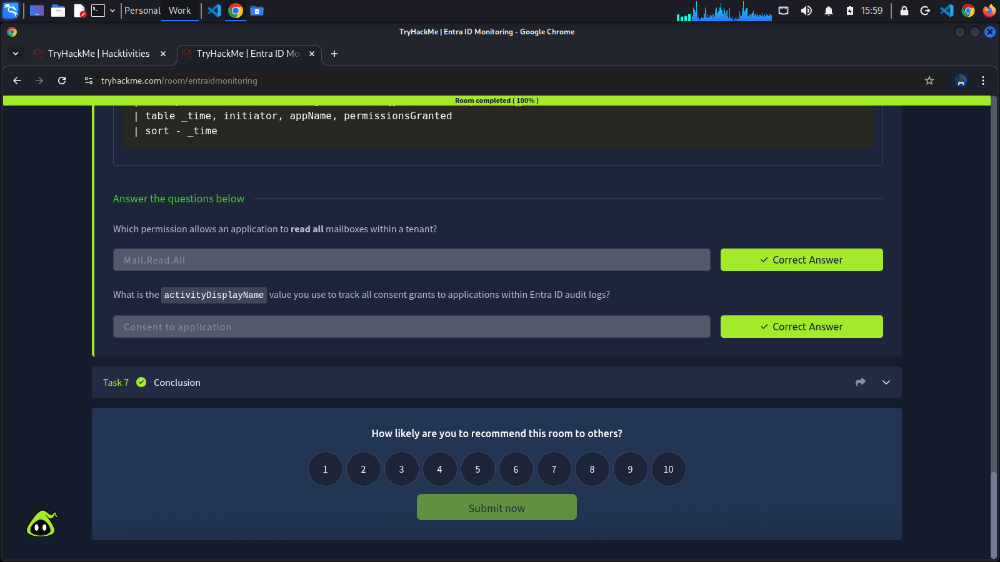

Password reset, MFA resets, and account lockouts. A thorough remediation effort can undo most of what an attacker achieved through credential theft. However, there is one persistent mechanism that survives it all: a consented OAuth application.

It is one of the stealthiest persistence methods available to an attacker because the access isn't tied to the user's credentials at all. It lives in the application layer, and most organizations are not actively monitoring it.

## How OAuth Consent Works
OAuth (Open Authorization) is the protocol that powers the "Sign in with Google" or "Connect your Microsoft account". It allows a third-party application to request access to a user's resources on a platform, such as M365, without ever handling the user's password. Instead, the user (or an administrator) reviews a consent screen listing what the application wants to do, approves it, and the platform issues an **access token** granting that application those permissions.

From an attacker's perspective, this is ideal. Once a user or admin clicks "Accept", the application holds a persistent grant to the user's data via API. That access:
- Survives password changes, because it's not credential-based.
- Survives MFA resets, because authentication already happened at consent time.
- Requires active recovation, not just credential remediation, to remove.

## Delegated vs Application Permissions
Not all consent grants are equal. Microsoft's permission model has two distinct types, and understanding the difference is critical for assessing how dangerous a consent grant is.

| |Delegated Permissions|Application Permissions|
|-|---------------------|-----------------------|
|Scope|Limited to what that user can access|Tenant-wide, by default|
|Who can consent|The user themselves (for low-risk scopes) or an admin|Admin only|
|Example|**Mail.Read** - read *this* user's mail|**Mail.Read.All** - read every mailbox in the org|

**Delegated permissions** are the most common and less alarming of the two. The app borrows the user's identity and canonly do what that user could do themselves. If that user leaves the organization, the grant become useless.

**Application permissions** are a different story. They grant the application a standing right to act across the entire tenant, independently of any user session. An app with **Mail.Read.All** cam silently read every mailbox in the organization indefinitely. An app with **RoleManagement.ReadWrite.Directory** can assign Entra ID roles. These permissions require admin consent precisely because of how powerful they are, which is also why tricking a Global Administrator into granting consent is one of the highest-value moves an attacker can make.

### High-risk Permission Scopes to Know
The followning permissions are commonly abused and should be treated as high-priority findings during a hunt:
- **Mail.Read.All**/**Mail.ReadWrite.All**: Read or modify all mailboxes in the tenant.
- **Files.ReadWrite.All**: Read and write all files across the SharePoint and OneDrive.
- **RoleManagement.ReadWrite.Directory**: Assign and remove Entra ID roles, including Global Administrator.
- **Directory.ReadWrite.All**: Read and write all directory data, including users and groups.
- **offline_access**: Maintain access indefinitely via refresh tokens, even when the user is not actively signed in.

Any consent grant that includes one or more of these scopes warrants immediate investigation.

## Detecting OAuth Abuse in Audit Logs
Consent grant events are captured in Audit logs under the **activityDisplayName** value **"Consent to application"**. The **targetResources** field is particularly important here since it contains both the application that was granted consent and the specific permissions that were approved.

When granting permissions to an application generates multiple log entries, the query below filters to the consent event itself and surfaces the fields most relevant to triage:

### List all consent grants to an application

    index="main" sourcetype="azure:aad:audit"
    activityDisplayName="Consent to application"
    | eval initiator=coalesce('initiatedBy.user.userPrincipalName','initiatedBy.app.displayName')
    | eval appName='targetResources{}.displayName'
    | eval permissionsGranted='targetResources{}.modifiedProperties{}.newValue'
    | table _time, initiator, appName, permissionsGranted
    | sort - _time

## Tasks Completed

