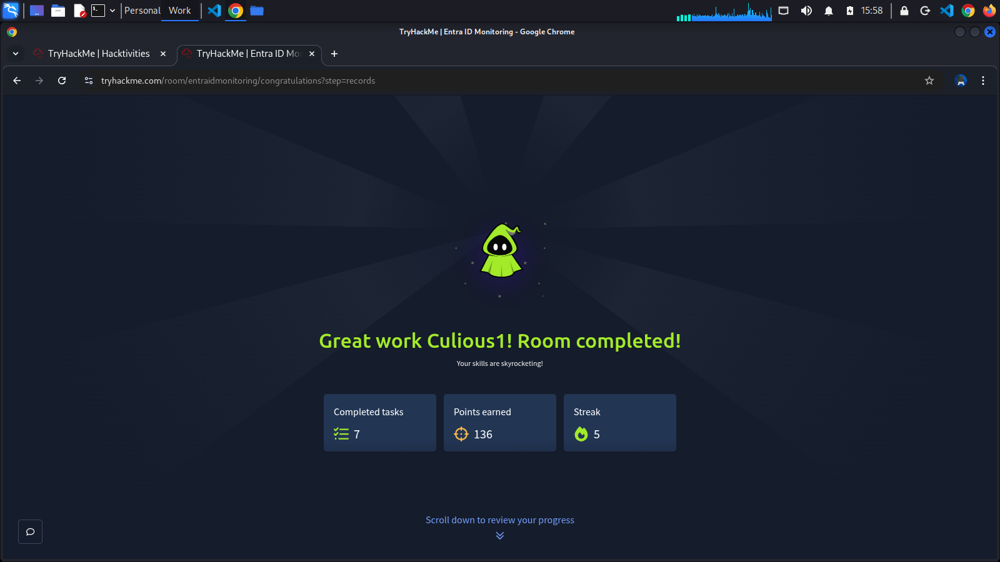

> 📘 Documentation and notes for the [Entra ID Monitoring](https://tryhackme.com/room/entraidmonitoring) room on TryHackMe.

## 📋 Overview

This room covers monitoring and threat detection within **Microsoft Entra ID** (formerly Azure Active Directory). It is designed for SOC analysts, cloud security engineers, and blue teamers looking to understand identity-based attack detection and log analysis in Microsoft's cloud identity platform.

## 🎯 Learning Objectives

- Understand the Microsoft Entra ID logging and monitoring architecture
- Identify suspicious sign-in activity and authentication anomalies
- Analyze audit logs, sign-in logs, and identity protection alerts
- Detect common identity-based attacks (e.g., password spray, MFA fatigue, token theft)
- Leverage Microsoft Sentinel and Entra ID Diagnostics for threat detection

## 🔧 Tools & Resources

| Tool | Purpose |
|------|---------|
| [Microsoft Entra Admin Center](https://entra.microsoft.com) | Primary portal for Entra ID management and log review |
| [Microsoft Sentinel](https://azure.microsoft.com/en-us/products/microsoft-sentinel) | SIEM for centralized log analysis and alerting |
| [Log Analytics Workspace](https://learn.microsoft.com/en-us/azure/azure-monitor/logs/log-analytics-overview) | KQL-based log querying |
| [Entra ID Identity Protection](https://learn.microsoft.com/en-us/entra/id-protection/overview-identity-protection) | Risk-based conditional access and alerts

## 📚 References

- [Microsoft Entra ID Documentation](https://learn.microsoft.com/en-us/entra/identity/)
- [Entra ID Sign-in Log Schema](https://learn.microsoft.com/en-us/entra/identity/monitoring-health/reference-sign-ins-error-codes)
- [Microsoft Sentinel Detection Rules](https://github.com/Azure/Azure-Sentinel)
- [MITRE ATT&CK — Initial Access via Valid Accounts](https://attack.mitre.org/techniques/T1078/)
- [TryHackMe Room](https://tryhackme.com/room/entraidmonitoring)

## Room Completed

